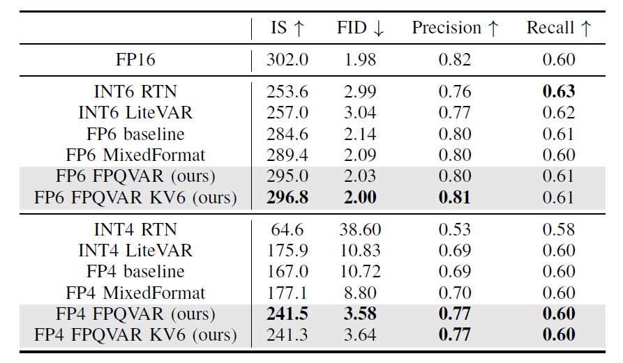
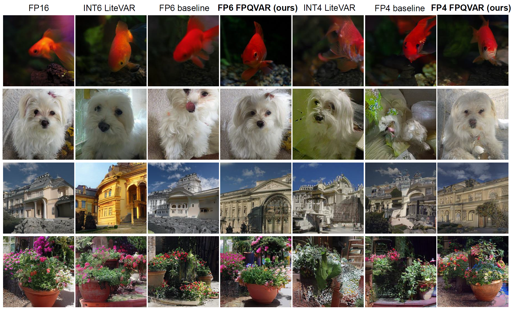

# FPQVAR
This is the official implementation of the algorithm part of "FPQVAR: Floating Point Quantization for Visual Autoregressive Model with FPGA Hardware Co-design"

Paper link: https://arxiv.org/abs/2505.16335


## Prepare

### Install Environment

1. Install pip packages: `pip install -r requirements.txt`

2. Install the cuda kernel for floating point quantization: `pip install ./quant`

### Download model and evaluation dataset

1. Download pretrained VAR model from [VAR](https://huggingface.co/FoundationVision/var)

2.  Download the reference ground truth npz file: [256x256](https://openaipublic.blob.core.windows.net/diffusion/jul-2021/ref_batches/imagenet/256/VIRTUAL_imagenet256_labeled.npz) and 
[512x512](https://openaipublic.blob.core.windows.net/diffusion/jul-2021/ref_batches/imagenet/512/VIRTUAL_imagenet512.npz)


## Quantize and Evaluate

Please follow the evaluation process as below. 
We demonstrate the commands for ImageNet 256x256 FP4 quantization.
Commands for other configurations can be found in [run.sh](./run.sh)

 1. Quantize and generate images

 ```python evaluate_fp_quant_transform_rotate.py --quant --w_bit 4 --a_bit 4 --weight_quant per_group --act_quant per_group --act_sym --activation_fp_quant --weight_fp_quant --act_fp_type fp_e2 --weight_fp_type fp_e2 --fc2_fp_type fp_e1m2_neg_e2m1_pos --rotate --block_rotate --transform```


2. Pack the generated images into an npz file

```python pack_figs.py --file_path path_to_the_folder_storing_generated_images```


3. Evaluate with OpenAI's evaluation toolkit  

```python openai_evaluator.py path_to_the_folder_storing_reference_images path_to_the_folder_storing_generated_images```


### GHT-Aware Learnable Transformation

The code of GHT-Aware Learnable Transformation (GALT) can be found in [learnable_transformation/](./learnable_transformation/).
The learned smoothing factors for VAR-30 (256x256) and VAR-36 (512x512) are available in [learnable_transformation/best_lambda_var30](./learnable_transformation/best_lambda_var30/) and [learnable_transformation/best_lambda_var36](./learnable_transformation/best_lambda_var36/), respectively.


## Experimental Results





## Citation
If our work assists your research, please give us a star ⭐ or cite us using:
```
@article{wei2025fpqvar,
  title={FPQVAR: Floating Point Quantization for Visual Autoregressive Model with FPGA Hardware Co-design},
  author={Wei, Renjie and Xu, Songqiang and Guo, Qingyu and Li, Meng},
  journal={arXiv preprint arXiv:2505.16335},
  year={2025}
}

```